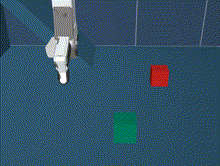
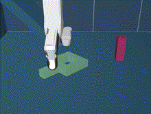
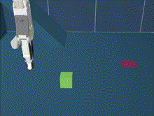
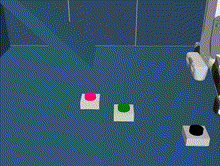
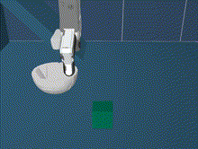
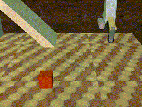

# MUSE: MUjoco Simulation Environments
<div style="overflow: hidden; display: inline-block;">





</div>
<div style="overflow: hidden; display: inline-block;">




</div>

MUSE is a learning environment with a rich set of robotic manipulation tasks with different challenges such as: multimodality, long term, non-prehensile manipulation, deformable objects, etc. MUSE is based on the [MuJoCo](https://github.com/deepmind/mujoco) physics engine and simulations are based on an UR5 robotic arm equipped with an RG6 gripper. 


## Run expert trajectories

Run
```
python -m muse.run --env Pick-v0
```
Use `--render` to generate mp4 videos from cameras.

## Installation

### Install MuJoCo

Download mujoco 2.1.0 [binaries](https://mujoco.org/download) and extract them in `~/.mujoco/mujoco210`.<br/>

Then setup the environment variable by adding to your `.bashrc` the following:
```
export LD_LIBRARY_PATH=$LD_LIBRARY_PATH:$HOME/.mujoco/mujoco210/bin:/usr/lib/nvidia
```

### Conda Environment

Install python dependencies by creating an environment with `anaconda`:
```
conda env create -f environment.yml
```

On a local machine install the following libraries with sudo rights (from [mujoco-py](https://github.com/openai/mujoco-py#ubuntu-installtion-troubleshooting)):
```
sudo apt install libosmesa6-dev libgl1-mesa-glx libglfw3
```

Then install `muse`:
```
pip install -e .
```

## GUI Rendering

To render the scene in a GUI, add to your `.bashrc`:
```
export LD_PRELOAD=/usr/lib/x86_64-linux-gnu/libGLEW.so
```
To render images from a camera, run `unset LD_PRELOAD`. Currently it is not possible to both have a GUI window and render camera images.

## Sim2Real 

### Domain randomization



Download BOP textures with:
```
python -m muse.tools.download_bop_textures --n 256 --crop-size 256
```

Then you could run an environment with DR by appending `DR-` to the environment name:

```
python -m muse.run --env DR-Pick-v0
```

## Quaternions

Mujoco quaternion representation is `q = (w x y z)`, the neutral element is `q = (1 0 0 0)`. This is not consistent with the most common `q = (x y z w)` representation in other libraries where the neutral element is `q = (0 0 0 1)`. Be careful to switch the quaternion representation when using poses coming from calibration softwares to place elements of the scene.

## Citations

Please, if you use this repository in you research project, think about properly citing our work:

```
 @article{garcia2023,
    author    = {Ricardo Garcia and Robin Strudel and Shizhe Chen and Etienne Arlaud and Ivan Laptev and Cordelia Schmid},
    title     = {Robust visual sim-to-real transfer for robotic manipulation},
    journal   = {International Conference on Intelligent Robots and Systems (IROS)},
    year      = {2023}
}    
```
